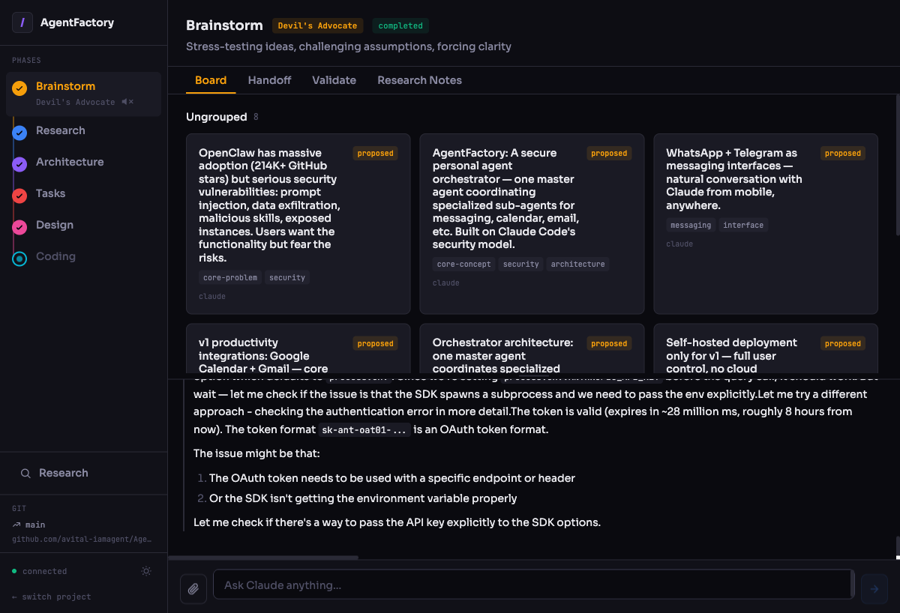
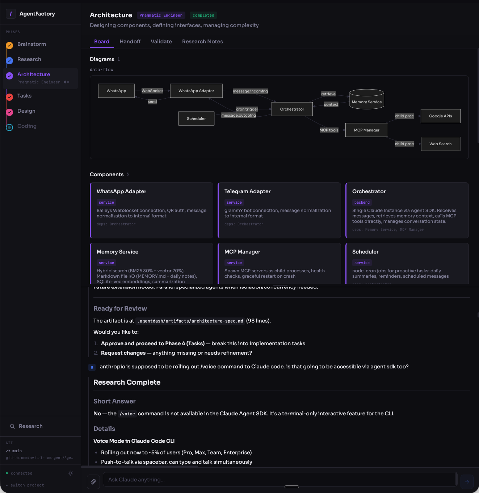
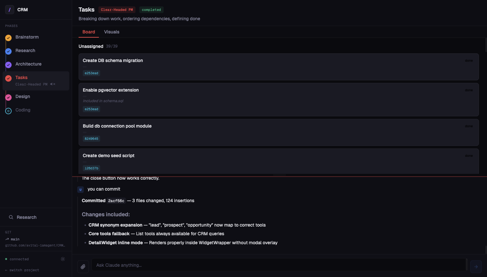

# AgentDash

A visual project dashboard where you and Claude Code collaborate through the full software development lifecycle — from brainstorming to implementation.

AgentDash is a web wrapper around Claude Code, built on the [Claude Agent SDK](https://www.npmjs.com/package/@anthropic-ai/claude-agent-sdk). It doesn't call the Anthropic API directly — it spawns Claude Code as a subprocess and communicates through the SDK, inheriting your existing Claude Code authentication. If Claude Code works on your machine, AgentDash works too.

Instead of free-form chat, it turns Claude Code into a structured development partner that guides your project through six phases, each with a dedicated AI personality and a clear handoff to the next. All state lives in your file system as readable JSON and Markdown — no databases, no cloud, no magic.

## See It In Action

> AgentFactory — a real project built with AgentDash





## How It Works

You type prompts in the browser. Claude Code reads and writes structured files in a `.agentdash/` directory inside your project. A local Express server bridges the two using the Claude Agent SDK, streaming responses in real time over WebSocket.

The UI is read-only — only Claude modifies project state. This keeps things simple and conflict-free.

## The Six Phases

| Phase | AI Personality | What Happens |
|-------|---------------|-------------|
| **Brainstorm** | The Devil's Advocate | Capture and challenge ideas on a card canvas |
| **Research** | The Skeptical Analyst | Gather evidence, question sources, build a knowledge base |
| **Architecture** | The Pragmatic Engineer | Design components and relationships with Mermaid diagrams |
| **Tasks** | The Clear-Headed PM | Break work into milestones and tasks on a Kanban board |
| **Design** | The Creative Director | Review UI tasks, generate reference mockups with AI image generation, annotate tasks with design notes |
| **Coding** | The Master Engineer | Work through tasks sequentially, verify each one, commit, and update state in place |

Each phase produces a compact handoff artifact that becomes the sole context for the next phase — solving the AI context-loss problem.

### Cross-Phase Tools

- **Research Assistant** — spin up in any phase to investigate a question without leaving your current work
- **Phase Review** — optional auditor that checks completeness and consistency at the end of a phase

### Nano Banana (AI Visuals)

Optional AI image generation powered by Google Gemini. During the Design phase, Claude can generate UI reference mockups to visualize what you're building before writing code. Images are stored locally and displayed in a gallery panel with lightbox, download, and pop-out support. Requires a free [Google API key](https://aistudio.google.com/apikey).

### Text-to-Speech

Optional real-time TTS that reads Claude's streamed responses aloud. Strips code blocks and markdown for natural speech. Enable with `agentdash --tts on` or during the installer.

## Prerequisites

- [Claude Code](https://docs.anthropic.com/en/docs/claude-code) installed and authenticated
- Node.js 18+
- git

## Installation

The quickest way to install is with Claude Code itself:

```bash
claude --append-system-prompt "$(curl -sL https://raw.githubusercontent.com/avital-iamagent/AgentDash/main/install-prompt.md)" --allowedTools "Bash,Read,AskUserQuestion"
```

This starts an interactive session where Claude presents clickable preference options (install location, model, TTS, port), then runs the install script. Type **`go`** to begin when prompted.

### Manual Installation

```bash
git clone https://github.com/avital-iamagent/AgentDash.git
cd AgentDash
npm install
npm run build
```

## Upgrading

```bash
cd ~/.agentdash/app   # or wherever you installed it
git pull
npm install
npm run build
```

Your project data in `.agentdash/` directories is untouched — upgrades only update the app itself.

## Usage

```bash
# Start the dashboard (opens http://localhost:3141)
agentdash

# Or if installed manually
npm start
```

### CLI Options

```
agentdash                  Start the server (default port: 3141)
agentdash --port <number>  Start on a specific port
agentdash --tts on|off     Enable or disable text-to-speech
agentdash --help           Show this help message
```

Configuration is stored in `~/.agentdash/config.json`.

## Tech Stack

React 19, TypeScript, Vite, Tailwind CSS 4, Express 5, WebSocket, Zustand, Zod, Mermaid.js, Google Gemini API, Claude Agent SDK

## License

MIT
